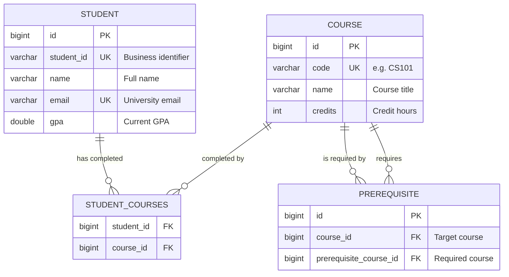

# System Overview

> **Note:** For exact implemented state, see [Current Architecture Baseline](./current-architecture-baseline.md).  
> This overview provides high-level architecture context.

## Project Summary

Academic Advisor is an AI-powered academic planning system built for SDU University students. It helps students navigate course selection, verify prerequisite chains, and receive personalized advising through a conversational interface powered by Google Gemini AI.

The application is developed as part of the Project Management Information Systems course, following Agile/Scrum methodology with 7 two-week sprints by a 5-member engineering team.

---

## Tech Stack

| Layer | Technology | Purpose |
|---|---|---|
| **Language** | Java 17 (LTS) | Application runtime |
| **Framework** | Spring Boot 3.x | Web MVC, dependency injection, auto-configuration |
| **Web** | Spring Web (embedded Tomcat) | HTTP request handling |
| **View Engine** | Thymeleaf | Server-side HTML rendering |
| **ORM** | Spring Data JPA + Hibernate | Database abstraction and entity mapping |
| **Database** | SQLite (default/test), PostgreSQL 16 (`docker` profile) | Relational data store by profile |
| **Migrations** | Hibernate `ddl-auto` | Automatic schema sync (Flyway planned) |
| **Security** | Session-based guard in controllers (`HttpSession`) | MVP authentication baseline |
| **Validation** | Spring Validation (JSR 380) | Input validation via Bean Validation annotations |
| **AI Integration** | Google Gemini API | Conversational academic advising |
| **HTTP Client** | Spring `RestClient` | Outbound API calls to Gemini |
| **Build** | Maven Wrapper | Reproducible builds without pre-installed Maven |
| **Dev Tooling** | Lombok, Spring DevTools | Boilerplate reduction, hot-reload |
| **Containers** | Docker, Docker Compose | Local development and deployment |
| **CI** | GitHub Actions | Automated build and test pipeline |

---

## Architecture

The application follows a **Layered MVC Architecture**, separating concerns across well-defined tiers. Each layer has a single responsibility and communicates only with adjacent layers.

```
┌──────────────────────────────────────────────────────────────┐
│                        Client (Browser)                      │
└──────────────────────┬───────────────────────────────────────┘
                       │ HTTP
┌──────────────────────▼────────────────────────────────────────┐
│              Session Guard (controller-level checks)          │
│       (`authenticatedStudentId` in HttpSession attribute)     │
└──────────────────────┬────────────────────────────────────────┘
                       │
┌──────────────────────▼─────────────────────────────────────────┐
│                     Controller Layer                           │
│                                                                │
│  AuthController          DashboardController                   │
│  · GET/POST /login       · GET /dashboard                      │
│  · GET /logout           · POST /dashboard/chat (@ResponseBody)│
│                                                                │
│  Responsibilities:                                             │
│  · HTTP request binding and input validation                   │
│  · Session management                                          │
│  · View resolution (Thymeleaf) or JSON responses               │
│  · No business logic                                           │
└──────────────────────┬─────────────────────────────────────────┘
                       │
┌──────────────────────▼────────────────────────────────────────┐
│                      Service Layer                            │
│                                                               │
│  AiService               StudentService*    AdvisingService*  │
│  · Gemini API prompt     · Profile CRUD     · Course recs     │
│    orchestration         · GPA tracking     · Prerequisite    │
│  · Response parsing      · Enrollment         validation      │
│  · Error handling          history                            │
│                                                               │
│  Responsibilities:                                            │
│  · All business logic and domain rules                        │
│  · AI prompt construction with student context                │
│  · Transaction management                                     │
│  (* = planned for upcoming sprints)                           │
└───────┬──────────────────────────────────┬────────────────────┘
        │                                  │
┌───────▼──────────────┐    ┌──────────────▼───────────────────┐
│  Repository Layer    │    │     External: Gemini REST API    │
│                      │    │                                  │
│  StudentRepository   │    │  POST /models/{model}:           │
│  CourseRepository    │    │       generateContent            │
│  PrerequisiteRepo    │    │                                  │
│                      │    │  Auth: x-goog-api-key header     │
│  Spring Data JPA     │    │  Format: JSON request/response   │
│  interfaces with     │    │  DTOs: GeminiRequest/Response    │
│  derived queries     │    │         (Java records)           │
└───────┬──────────────┘    └──────────────────────────────────┘
        │
        │ JPA / Hibernate
┌───────▼──────────────┐
│ SQLite (default/test)│
│ PostgreSQL (docker)  │
│                      │
│  Schema managed by   │
│  Hibernate ddl-auto  │
└──────────────────────┘
```

---

## Project Structure

```
advisor/
├── .github/
│   ├── ISSUE_TEMPLATE/           # GitHub Issue forms (user stories, bugs)
│   ├── workflows/ci.yml          # CI pipeline
│   └── PULL_REQUEST_TEMPLATE.md  # PR checklist
│
├── docs/
│   ├── architecture/             # System design documents
│   │   └── system-overview.md    # ← You are here
│   ├── db/schema.md              # Database ER diagram and table definitions
│   └── adr/                      # Architecture Decision Records
│
├── src/
│   ├── main/
│   │   ├── java/kz/edu/sdu/advisor/
│   │   │   ├── config/           # Spring configuration and bean definitions
│   │   │   ├── controller/       # Web endpoints and view controllers
│   │   │   ├── exception/        # Custom exception hierarchy
│   │   │   ├── model/            # JPA entities and DTOs
│   │   │   │   └── dto/gemini/   # Gemini API request/response records
│   │   │   ├── repository/       # Spring Data JPA interfaces
│   │   │   └── service/          # Business logic layer
│   │   └── resources/
│   │       ├── static/           # CSS, JavaScript, images
│   │       ├── templates/        # Thymeleaf HTML views
│   │       └── application.properties
│   └── test/                     # Unit and integration tests
│
├── .env.example                  # Environment variable template
├── docker-compose.yml            # PostgreSQL + app containers
├── Dockerfile                    # Multi-stage application build
├── CONTRIBUTING.md               # Team engineering guidelines
├── README.md                     # Project overview and quick start
└── pom.xml                       # Maven build configuration
```

---

## Data Model

The domain model consists of three core entities that represent students, courses, and their prerequisite relationships.



| Entity | Table | Description |
|---|---|---|
| `Student` | `students` | University student profile with GPA and enrollment history |
| `Course` | `courses` | Course catalog entries with codes and credit weights |
| `Prerequisite` | `prerequisites` | Directed prerequisite edges between courses |
| — | `student_courses` | Join table for the Student ↔ Course many-to-many relationship |

> For detailed column definitions and constraints, see [Database Schema](../db/schema.md).

---

## External Integrations

### Google Gemini AI

The application integrates with Google's Gemini API to provide conversational academic advising. The integration is implemented through a dedicated service layer with a custom exception hierarchy for robust error handling.

**Request Flow:**

```
User message → DashboardController → AiService → RestClient → Gemini API
                                                                    │
                                              GeminiResponse ◄──────┘
                                                    │
                                          extractText()
                                                    │
                                        JSON reply → Browser
```

**Configuration** (via `GeminiProperties`):

| Property | Default | Source |
|---|---|---|
| `gemini.api.key` | — (required) | `.env` file (`GEMINI_API_KEY`) |
| `gemini.api.base-url` | `https://generativelanguage.googleapis.com/v1beta` | `application.properties` |
| `gemini.api.model` | `gemini-3.6-flash` | `.env` file |
| `gemini.api.connect-timeout` | `5s` | `application.properties` |
| `gemini.api.read-timeout` | `20s` | `application.properties` |

**Error Handling:**

```
RuntimeException
└── GeminiApiException              (base: unexpected API failures)
    ├── GeminiAuthenticationException (401/403 or missing API key)
    └── GeminiTimeoutException       (connection/read timeout)
```

---

## Security

Authentication currently uses an MVP session-based approach without Spring Security. Students authenticate using their university Student ID, and the session is tracked through an HTTP cookie.

| Aspect | Implementation |
|---|---|
| **Authentication** | Student ID lookup against the `students` table |
| **Session** | Server-side `HttpSession` with `authenticatedStudentId` attribute |
| **CSRF** | No explicit Spring Security CSRF middleware configured |
| **Session Fixation** | No dedicated mitigation layer yet |
| **Public Endpoints** | `/login`, static resources (`/css/**`, `/js/**`, `/images/**`) |
| **Protected Endpoints** | `/dashboard`, `/dashboard/chat`, all other routes |

---

## Configuration Management

The application uses Spring profiles to manage environment-specific settings.

| Profile | Database | AI Key Source | Usage |
|---|---|---|---|
| `default` | SQLite (`advisor.db`) | `.env` file | Local development (`./mvnw spring-boot:run`) |
| `docker` | PostgreSQL (`db:5432`) | `docker-compose.yml` env | Full Docker Compose stack |
| `test` | SQLite (`target/test-advisor.db`) | Not required (mocked) | Automated test suite |

**Secrets Management:**

All sensitive values (API keys, database credentials) are externalized:
- **Local development:** Loaded from a `.env` file (git-ignored) via `spring.config.import`.
- **Docker Compose:** Injected as container environment variables.
- **CI:** Provided via GitHub Actions secrets (when needed).

> See [`.env.example`](../../.env.example) for the full list of configurable environment variables.

---

## Deployment

### Development Environment (Docker Compose)

```
┌─────────────────────────────────────────────┐
│              Docker Compose                 │
│                                             │
│  ┌────────────┐       ┌──────────────────┐  │
│  │ PostgreSQL │◄──────│  Spring Boot App │  │
│  │  :5432     │  JDBC │  :8080           │  │
│  └────────────┘       └───────┬──────────┘  │
│       │                       │             │
│    pgdata                     │             │
│   (volume)                    │             │
└───────────────────────────────┼─────────────┘
                                │
                    ┌───────────▼──────────┐
                    │   Gemini REST API    │
                    │   (external)         │
                    └──────────────────────┘
```

| Command | Description |
|---|---|
| `docker compose up --build` | Start the full stack (app + database) |
| `docker compose up db` | Start only PostgreSQL (for local `./mvnw` development) |
| `docker compose down -v` | Stop and remove all containers and volumes |

### Dockerfile

The application uses a **multi-stage build** to minimize the final image size:

1. **Build stage** (`eclipse-temurin:17-jdk`): Resolves Maven dependencies, compiles, and packages the application.
2. **Runtime stage** (`eclipse-temurin:17-jre-alpine`): Copies only the built JAR for a minimal production image.

---

## CI/CD

A GitHub Actions workflow runs on every pull request and push to `main`:

1. **Checkout** the repository.
2. **Set up** Java 17 (Eclipse Temurin) with Maven dependency caching.
3. **Build and test** via `./mvnw clean test`.

> The pipeline configuration is at [`.github/workflows/ci.yml`](../../.github/workflows/ci.yml).
