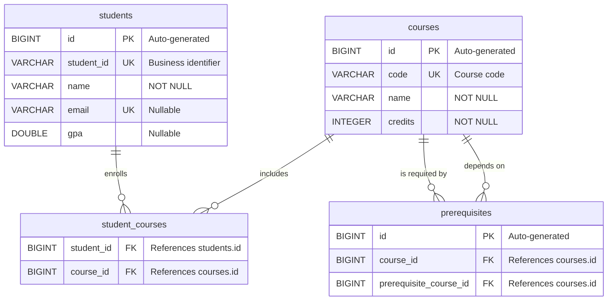

# Database Schema

This document describes the relational schema used by the Academic Advisor application. The schema is generated from JPA entities using Hibernate `ddl-auto` (current state). Database engine depends on active profile: SQLite for `default`/`test`, PostgreSQL for `docker`.

## Entity-Relationship Diagram

## Tables

### `students`

Stores registered student records. Each student is uniquely identified by a business identifier (`student_id`) separate from the database primary key.

| Column       | Type    | Constraints      | Description                                      |
|--------------|---------|------------------|--------------------------------------------------|
| `id`         | BIGINT  | PK, AUTO         | Database primary key, auto-generated.            |
| `student_id` | VARCHAR | NOT NULL, UNIQUE  | Business identifier (e.g. `"240103000"`).        |
| `name`       | VARCHAR | NOT NULL          | Full name of the student.                        |
| `email`      | VARCHAR | UNIQUE            | Email address. Nullable.                         |
| `gpa`        | DOUBLE  | —                 | Grade point average. Nullable.                   |

### `courses`

Stores the course catalog. Each course has a unique code and a credit weight.

| Column    | Type    | Constraints      | Description                                      |
|-----------|---------|------------------|--------------------------------------------------|
| `id`      | BIGINT  | PK, AUTO         | Database primary key, auto-generated.            |
| `code`    | VARCHAR | NOT NULL, UNIQUE  | Short course code (e.g. `"CS101"`).              |
| `name`    | VARCHAR | NOT NULL          | Full course title (e.g. `"Introduction to Computer Science"`). |
| `credits` | INTEGER | NOT NULL          | Number of credit hours.                          |

### `prerequisites`

Represents directed prerequisite relationships between courses. A row states that **`course_id` requires `prerequisite_course_id`** to be completed first. The composite pair `(course_id, prerequisite_course_id)` is unique.

| Column                  | Type   | Constraints              | Description                                       |
|-------------------------|--------|--------------------------|---------------------------------------------------|
| `id`                    | BIGINT | PK, AUTO                 | Database primary key, auto-generated.             |
| `course_id`             | BIGINT | FK → `courses.id`, NOT NULL | The course that has the prerequisite.           |
| `prerequisite_course_id`| BIGINT | FK → `courses.id`, NOT NULL | The course that must be completed first.        |

**Unique constraint:** `(course_id, prerequisite_course_id)`

## Join Table: `student_courses`

Implements the **Many-to-Many** relationship between `students` and `courses`. A row indicates that a student is enrolled in (or has completed) a course.

| Column       | Type   | Constraints            | Description                  |
|--------------|--------|------------------------|------------------------------|
| `student_id` | BIGINT | FK → `students.id`     | Reference to the student.    |
| `course_id`  | BIGINT | FK → `courses.id`      | Reference to the course.     |

## Seed / Demo Data

The application ships with seed data for development and demonstration purposes.

| Entity   | Key Fields                                                                 |
|----------|----------------------------------------------------------------------------|
| Student  | `student_id = "240103000"`, name = "John Doe", email = `240103000@sdu.edu.kz`, GPA = 3.8 |
| Course   | `code = "CS101"`, name = "Introduction to Computer Science", credits = 3   |
| Course   | `code = "MATH101"`, name = "Calculus I", credits = 4                       |
