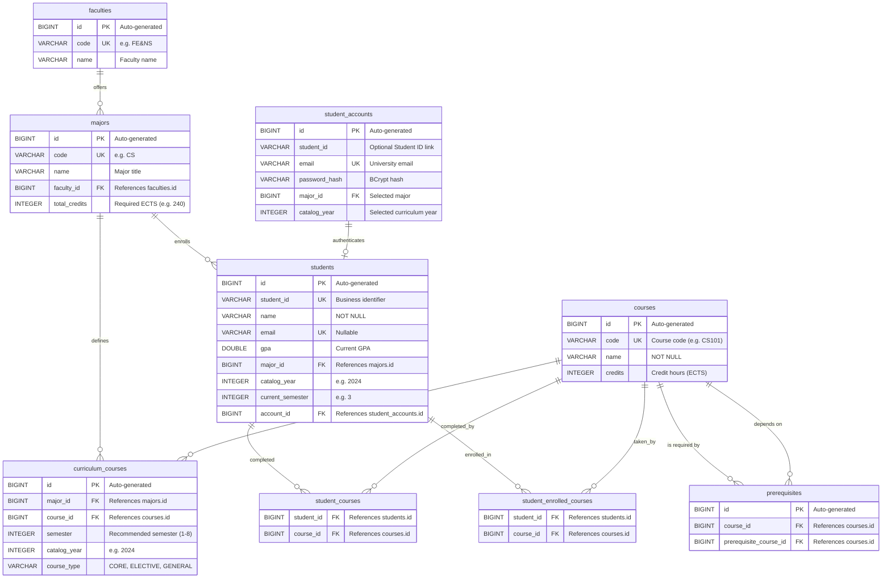

# Database Schema

This document describes the relational schema used by the Academic Advisor application. The schema is generated from JPA entities using Hibernate `ddl-auto` (current state). Database engine depends on active profile: SQLite for `default`/`test`, PostgreSQL for `docker`.

## Entity-Relationship Diagram

## Tables

### `faculties`

Stores university faculties.

| Column | Type | Constraints | Description |
|---|---|---|---|
| `id` | BIGINT | PK, AUTO | Database primary key. |
| `code` | VARCHAR | NOT NULL, UNIQUE | Faculty code (e.g. `"FE&NS"`). |
| `name` | VARCHAR | NOT NULL | Faculty title. |

### `majors`

Stores degree programs and their total credit requirements.

| Column | Type | Constraints | Description |
|---|---|---|---|
| `id` | BIGINT | PK, AUTO | Database primary key. |
| `code` | VARCHAR | NOT NULL, UNIQUE | Major code (e.g. `"CS"`). |
| `name` | VARCHAR | NOT NULL | Major title. |
| `faculty_id` | BIGINT | FK → `faculties.id`, NOT NULL | Faculty offering this program. |
| `total_credits`| INTEGER | NOT NULL (default 240) | Total degree credits needed. |

### `curriculum_courses`

Maps 4-year degree requirements by semester and catalog year for each major.

| Column | Type | Constraints | Description |
|---|---|---|---|
| `id` | BIGINT | PK, AUTO | Database primary key. |
| `major_id` | BIGINT | FK → `majors.id`, NOT NULL | Major associated with this plan. |
| `course_id` | BIGINT | FK → `courses.id`, NOT NULL | Course required in this curriculum. |
| `semester` | INTEGER | NOT NULL | Recommended semester number (1–8). |
| `catalog_year` | INTEGER | NOT NULL | Curriculum version year (e.g. 2024). |
| `course_type` | VARCHAR | NOT NULL | Type: `CORE`, `ELECTIVE`, `GENERAL`. |

**Unique constraint:** `(major_id, course_id, catalog_year)`

### `students`

Stores student academic profiles.

| Column | Type | Constraints | Description |
|---|---|---|---|
| `id` | BIGINT | PK, AUTO | Database primary key. |
| `student_id` | VARCHAR | NOT NULL, UNIQUE | Business identifier (e.g. `"240103000"`). |
| `name` | VARCHAR | NOT NULL | Full name of the student. |
| `email` | VARCHAR | UNIQUE | Email address. |
| `gpa` | DOUBLE | — | Grade point average. |
| `major_id` | BIGINT | FK → `majors.id` | Student's enrolled major. |
| `catalog_year` | INTEGER | — | Catalog year governing their curriculum. |
| `current_semester` | INTEGER | — | Current semester (e.g. 3). |
| `account_id` | BIGINT | FK → `student_accounts.id` | Linked authentication account. |

### `student_accounts`

Stores login credentials.

| Column | Type | Constraints | Description |
|---|---|---|---|
| `id` | BIGINT | PK, AUTO | Database primary key. |
| `student_id` | VARCHAR | — | Associated student ID. |
| `email` | VARCHAR | NOT NULL, UNIQUE | Normalized university email address. |
| `password_hash` | VARCHAR | NOT NULL | BCrypt hash. |
| `major_id` | BIGINT | FK → `majors.id` | Major selected during registration. |
| `catalog_year` | INTEGER | — | Curriculum version selected during registration. |

### `courses`

Stores the course catalog.

| Column | Type | Constraints | Description |
|---|---|---|---|
| `id` | BIGINT | PK, AUTO | Database primary key. |
| `code` | VARCHAR | NOT NULL, UNIQUE | Course code (e.g. `"CS101"`). |
| `name` | VARCHAR | NOT NULL | Course title. |
| `credits` | INTEGER | NOT NULL | Number of credit hours (ECTS). |

### `prerequisites`

Represents directed prerequisite relationships between courses (`course_id` requires `prerequisite_course_id`).

| Column | Type | Constraints | Description |
|---|---|---|---|
| `id` | BIGINT | PK, AUTO | Database primary key. |
| `course_id` | BIGINT | FK → `courses.id`, NOT NULL | Course with prerequisite. |
| `prerequisite_course_id` | BIGINT | FK → `courses.id`, NOT NULL | Prerequisite that must be completed. |

**Unique constraint:** `(course_id, prerequisite_course_id)`

### Join Tables

- **`student_courses`**: Many-to-Many join table representing courses completed by the student.
- **`student_enrolled_courses`**: Many-to-Many join table representing courses currently taken by the student in their active semester.

## Seed / Demo Data

| Entity | Key Fields | Description |
|---|---|---|
| Faculty | `code = "FE&NS"` | Faculty of Engineering and Natural Sciences |
| Major | `code = "CS"`, `total_credits = 240` | Computer Science under FE&NS |
| Courses | 22 demo catalog courses | CS, MATH, ENG, PHYS, and general courses for the seeded Computer Science plan |
| Curriculum | 22 demo mappings | CS 2024 test curriculum across Semesters 1 through 8; not an official study plan |
| Student | `student_id = "240103000"`, `name = "John Doe"`, `email = "240103000@sdu.edu.kz"`, `GPA = 3.8`, `current_semester = 3` | Linked to account, 27 completed ECTS (Sem 1-2), 14 enrolled ECTS (Sem 3) |
| Account | `student_id = "240103000"`, password = `Student123!@#` | Hashed password for demo student |
